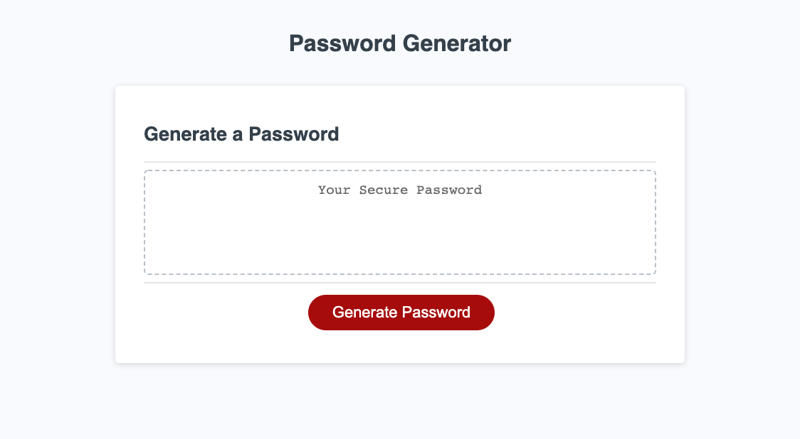

# PasswordGen-JS

## Description

This project was a great opportunity to build on my Javascript skills and to incorperate what I have learned in class to date. The problem to solve was generating a password based on a series of critieria. The user responds to prompts that in turn dictate the parameters of the code being produced. The new skills acquired through this exercise were the utilization of the 'push' as well as the 'math.random' methods.

## Installation

No installation requirements are necessary.

## Usage

Link to webapp:
https://lhwood.github.io/PasswordGen-JS/

## Credits

Libral use of W3Schools and MDN Web Docs during this project.
